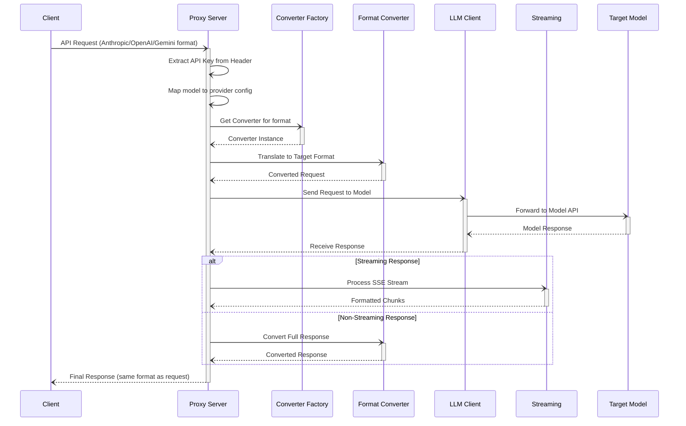

# Architecture

This document provides a high-level overview of the proxy's architecture.

## Core Components

The proxy is composed of several key components that work together to process API requests.

- **Proxy Server (`anthropic_proxy/server.py`)**: The main entry point of the application. It uses FastAPI to create a web server with prefixed endpoints (`/anthropic/v1/...`, `/openai/v1/...`, `/gemini/v1beta/...`) that accepts requests in multiple formats. It handles request validation, extracts API keys from headers, and delegates processing to other components.

- **Client (`anthropic_proxy/client.py`)**: Responsible for making outgoing requests to the underlying LLM APIs (e.g., OpenAI, Gemini, Anthropic-compatible providers). It uses `httpx` for Anthropic-format APIs and the AsyncOpenAI SDK for OpenAI-format APIs.

- **Converter Package (`anthropic_proxy/converters/`)**: A unified converter package with base classes and format-specific implementations:
  - `base.py`: Base converter classes (`BaseConverter`, `BaseStreamingConverter`)
  - `anthropic.py`: Anthropic format converter (identity pass-through)
  - `openai.py`: OpenAI format converter
  - `gemini.py`: Gemini format converter
  - `_openai_impl.py`: Legacy OpenAI implementation functions (backward compatibility)
  - `_gemini_impl.py`: Gemini implementation functions
  - `_gemini_streaming.py`: Gemini streaming implementation
  - `__init__.py`: Factory functions for dynamic converter selection

- **Converter Facade (`anthropic_proxy/converter.py`)**: Re-exports converters from the package for backward compatibility.

- **Streaming (`anthropic_proxy/streaming.py`)**: Streaming conversion facade that manages SSE chunk conversion with a state machine for handling content blocks, tool calls, and thinking blocks.

- **Configuration (`anthropic_proxy/config.py`)**: Manages the application's configuration, including server settings and model mappings. It loads settings from `config.json` and `models.yaml`. Note: API keys are no longer stored in config - they're passed via request headers from ccproxy.

- **Utilities (`anthropic_proxy/utils.py`)**: A collection of helper functions used across the application, such as error handling and usage tracking.

- **Types (`anthropic_proxy/types.py`)**: Defines the data structures and types used throughout the application, ensuring type safety and clarity.

## Multi-Format Endpoints

The proxy provides three endpoint formats to accept requests in different API styles:

1. **Anthropic Format** (`/anthropic/v1/...`): Accepts Anthropic Messages API format
2. **OpenAI Format** (`/openai/v1/...`): Accepts OpenAI Chat Completions API format
3. **Gemini Format** (`/gemini/v1beta/...`): Accepts Gemini GenerateContent API format

Each endpoint accepts requests in its respective format, internally routes based on the `format` field in `models.yaml`, and returns responses in the same format as the request.

## ccproxy Integration

This proxy is designed to work with **ccproxy** (Claude Code wrapper script), which handles API key management externally:

```
ccproxy (sets ANTHROPIC_BASE_URL=http://localhost:8082/anthropic/v1, passes API key via Authorization header)
    ↓
Claude Code (sends Anthropic-format requests with model name + auth header)
    ↓
claude-code-proxy (extracts key from header, maps model to API URL, converts format based on models.yaml)
    ↓
Provider API (receives format-converted request with API key)
```

**Key design decisions:**
- API keys are extracted from the `Authorization: Bearer <key>` header on each request
- Model-to-URL mapping and format routing is defined in `models.yaml` without storing any API keys
- Multi-format endpoints allow the proxy to accept requests in Anthropic, OpenAI, or Gemini format
- This allows unified key management through ccproxy's configuration

## Request Flow

The diagram below illustrates the request/response lifecycle within the proxy.



**Lifecycle Steps:**

1.  **Request Initiation**: A **Client** sends an API request to the **Proxy Server** in one of three formats: Anthropic, OpenAI, or Gemini.
2.  **Internal Processing**: The server extracts the API key from the `Authorization` header, maps the model to a provider configuration from `models.yaml`, and uses the **Converter Factory** to get the appropriate converter for the target format.
3.  **Format Conversion**: The **Format Converter** translates the request into the format expected by the **Target Model** based on the `format` field in `models.yaml`.
4.  **Model Communication**: The **LLM Client** sends the converted request to the target model's API and receives a response.
5.  **Response Handling**:
    - For **streaming** responses, the **Streaming** component processes the Server-Sent Events (SSE) stream using format-specific streaming converters.
    - For **non-streaming** responses, the **Converter** translates the entire payload.
6.  **Final Response**: The **Proxy Server** sends the final response back to the **Client** in the same format as the original request.
